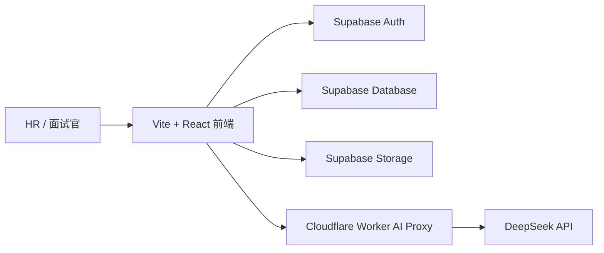

# TalentFlow AI 内部试用版架构规划

## 目标定位

TalentFlow AI 当前是前端 MVP，用于展示 HR 面试人才库系统的核心流程和 AI 工作流。内部试用版的目标不是商业化 SaaS，而是让公司内部 HR 小范围真实试用。

内部试用版重点解决：

- HR 登录后才能使用系统
- 候选人数据可多人共享
- 简历文件可安全保存
- DeepSeek API Key 不暴露在前端
- 候选人关键操作可追踪

当前阶段不做：

- 企业多租户
- 复杂组织架构
- 计费/套餐/商业化 SaaS 能力
- 大规模权限矩阵
- 一次性重构全部前端代码

## 当前 MVP 与内部试用版区别

| 能力 | 当前前端 MVP | 内部试用版 |
| --- | --- | --- |
| 登录认证 | 无登录 | Supabase Auth |
| 数据保存 | localStorage | Supabase Database |
| 多人共享 | 不支持 | 支持内部 HR 共享 |
| 简历文件 | 浏览器本地解析，不保存文件 | Supabase Storage 保存文件 |
| AI API | Mock / 自定义 Key / Worker 代理 | 默认通过 Cloudflare Worker 代理 |
| 操作记录 | 无统一审计 | operation_logs 记录关键操作 |
| 部署方式 | GitHub Pages | 前端仍可 GitHub Pages，数据/API 接 Supabase 和 Worker |

## 总体架构



## 数据库表设计

第一阶段表：

- `profiles`：用户基础信息和角色
- `candidates`：候选人主表
- `ai_reports`：AI 分析报告
- `operation_logs`：关键操作日志

### profiles

用于扩展 Supabase Auth 用户信息。

字段：

- `id`：关联 `auth.users.id`
- `email`
- `role`：`admin` / `hr` / `interviewer`
- `name`
- `created_at`

### candidates

保存候选人招聘流程主数据。

重点字段：

- 基础信息：姓名、岗位、来源
- 流程信息：面试时间、面试官、面试结果、报到时间、试用期状态
- 简历信息：简历文本、简历文件 URL、文件名
- JD：岗位要求文本
- 归档：`is_archived`
- 操作人：`created_by`

### ai_reports

保存一次 AI 分析结果，后续可以支持多次生成和历史对比。

字段包含：

- 匹配度评分
- 优势、不足、风险点
- 建议追问
- 是否建议进入下一轮
- 推荐面试结论
- 原始模型返回

### operation_logs

记录关键操作：

- 新增候选人
- 编辑候选人
- 删除候选人
- 归档/取消归档
- 生成 AI 分析
- 上传/替换简历

日志记录 before/after 数据，方便内部试用阶段排查问题。

## 权限设计

内部试用版先设计 3 个角色。

### admin

- 可查看全部候选人
- 可管理全部候选人
- 可查看操作日志
- 可管理用户角色

### hr

- 可新增、编辑、归档候选人
- 可上传简历
- 可生成 AI 分析
- 可查看候选人和数据看板

### interviewer

- 只能查看分配给自己的候选人
- 可填写面试评价
- 可查看候选人简历摘要和 JD
- 默认不允许删除候选人

第一阶段先写 RLS 策略设计和 SQL 预留注释，后续接 Supabase Auth 后逐步启用完整 RLS。

## 文件存储设计

使用 Supabase Storage。

建议 bucket：

- `resumes`

路径建议：

```text
resumes/{candidate_id}/{timestamp}-{original_file_name}
```

原则：

- 前端上传文件到 Supabase Storage
- 数据库只保存 `resume_file_url` 和 `resume_file_name`
- 简历文件不公开访问，使用 signed URL 或受权限控制的下载接口
- 文件解析可先继续在浏览器本地完成，正式版本可迁移到后端解析

## AI API 代理设计

继续保留 Cloudflare Worker 方案。

要求：

- DeepSeek API Key 只保存在 Worker 环境变量 `DEEPSEEK_API_KEY`
- 前端不写死默认 DeepSeek Key
- 前端只请求 Worker `/analyze`
- 请求体只传业务数据：候选人姓名、岗位、简历文本、JD、面试评价
- Worker 调用 DeepSeek Chat Completions API
- Worker 返回统一 JSON 给前端
- Worker 失败时前端自动回退 Mock AI 分析

后续可以增加：

- 请求频率限制
- 日志脱敏
- AI 调用记录入库
- 管理员开关默认 AI 服务

## 前端分阶段改造计划

### 第一阶段：架构规划和数据层抽象

本阶段完成：

- 新增内部试用版架构文档
- 新增 Supabase schema SQL
- 新增 `candidateService`
- `candidateService` 默认仍走 localStorage
- 不删除现有 localStorage 逻辑
- 不大改 UI
- 保持 GitHub Pages 演示可用

### 第二阶段：接入 Supabase Auth

目标：

- 增加登录页
- 登录后进入系统
- 创建 `profiles`
- 根据用户角色展示不同能力入口

建议优先做 Auth，因为数据库 RLS 和用户权限依赖登录身份。

### 第三阶段：候选人数据迁移到 Supabase Database

目标：

- `candidateService` 内部切换到 Supabase
- 列表、新增、编辑、归档、删除走数据库
- 保留 localStorage fallback 或演示模式开关

### 第四阶段：简历文件接入 Supabase Storage

目标：

- 上传 PDF/DOCX 到 Supabase Storage
- 保存文件名和 URL
- 简历文本继续作为字段保存
- 后续支持服务端解析

### 第五阶段：操作日志和 AI 报告入库

目标：

- 关键候选人操作写入 `operation_logs`
- AI 分析结果写入 `ai_reports`
- 数据看板从数据库聚合

## 风险与注意事项

- 候选人数据属于敏感信息，内部试用也要避免使用真实隐私数据做公开演示。
- GitHub Pages 只能托管前端，不能保存密钥。
- 默认 AI 服务必须通过 Worker 代理，不能把 DeepSeek Key 写入前端。
- Supabase RLS 启用前，不要把项目用于真实生产候选人数据。
- 文件存储应使用私有 bucket，不建议公开简历文件。

